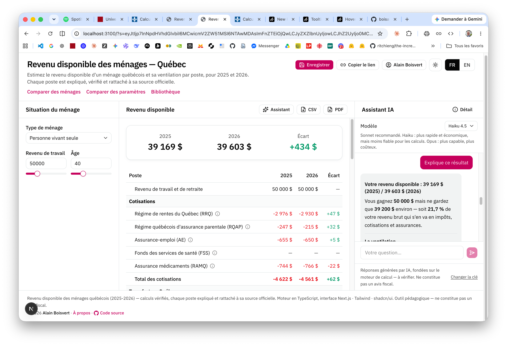
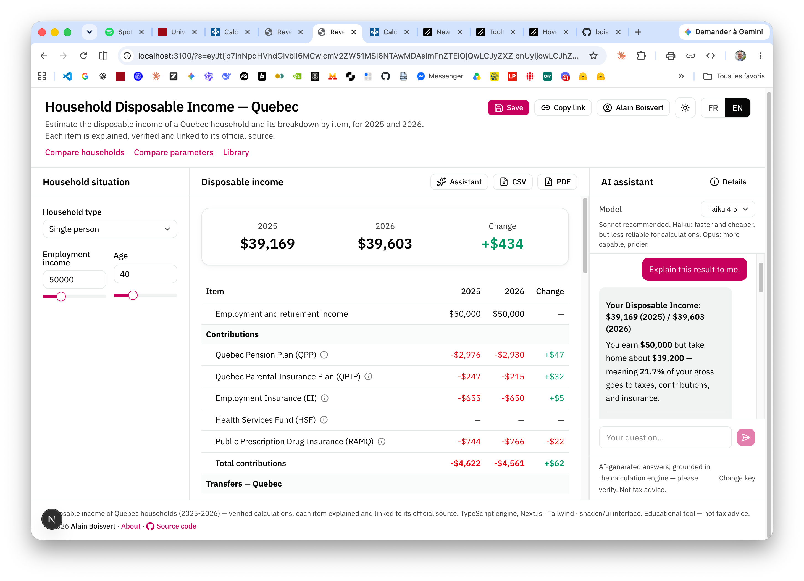

# Revenu disponible — Québec (2025 · 2026)

> **English version follows below ↓**

Combien vous reste-t-il **vraiment**, une fois payés vos impôts et vos cotisations et reçus vos transferts (allocations et crédits) ? Ce calculateur répond à la question pour un **ménage québécois** et vous en montre le **détail, poste par poste**, pour **2025 et 2026**.

**▶ Essayez-le : https://revenu-disponible.vercel.app/**



## En clair

Votre **revenu disponible**, c'est ce qui finit dans vos poches :

> revenus de travail et de retraite **+** transferts (allocations, crédits) **−** cotisations (RRQ, assurance-emploi…) **−** impôts

Le calculateur fait cette addition pour vous, **poste par poste**, et explique chaque montant. Tout repose sur des **cas de ménages types** et des **données fictives** : c'est un outil pour *comprendre*, pas pour produire votre déclaration de revenus.

## À qui ça s'adresse

**Au citoyen curieux** — pour voir ce qui vous reste réellement, et comment cela change si votre revenu, votre âge ou votre situation familiale varient. Pour comprendre pourquoi, à certains niveaux de revenu, **un dollar de plus ne rapporte presque rien** (les fameuses « trappes »).

**À l'étudiant en fiscalité** — pour voir concrètement comment s'emboîtent impôts, cotisations et transferts. Chaque poste s'accompagne de sa **règle de calcul**, de ses **références légales** et d'un **lien vers la source officielle**, et vous pouvez tester des scénarios « et si… ? » en modifiant les paramètres, comme à l'annonce d'un budget.

## Ce que vous pouvez faire

- **Calculer** le revenu disponible pour 5 situations (personne seule, famille monoparentale, couple, retraité seul, couple de retraités), selon le revenu, l'âge et le nombre d'enfants.
- **Comparer 2025 et 2026**, poste par poste, avec les écarts.
- **Comprendre chaque poste** : un panneau présente sa description, son objectif, sa règle de calcul, ses **paramètres officiels (2025 / 2026)** et le lien vers la source.
- **Voir le taux effectif marginal d'imposition** : un graphique montre, à chaque niveau de revenu, quelle part d'un dollar gagné en plus vous échappe, et repère les **trappes** (plus de 60 %).
- **Comparer deux ménages**, ou **deux jeux de paramètres** sur un même ménage (pour simuler un « mini-budget »).
- **Demander à un assistant IA** (Claude) d'expliquer un résultat ou de répondre à vos questions sur le modèle *(démo gratuite limitée, ou votre propre clé Anthropic)*.
- **Enregistrer, partager par lien, exporter en CSV ou PDF**, et conserver vos scénarios dans un compte.

L'interface est **bilingue (français et anglais)** et offre un **mode clair ou sombre**.

## D'où viennent les chiffres

Tous les chiffres — montants, taux et seuils — proviennent de **sources officielles** : Revenu Québec, l'Agence du revenu du Canada, Retraite Québec et Service Canada. Chacun renvoie à la loi qui le fixe ; rien n'est inventé.

Pour s'assurer que les calculs sont exacts, ils ont été **comparés au [calculateur officiel du ministère des Finances du Québec](https://www.finances.gouv.qc.ca/ministere/outils_services/outils_calcul/revenu_disponible/outil_revenu.asp)** : sur des milliers de cas, les résultats **concordent au cent près**.

Un **[guide pédagogique détaillé](docs/guide/main.pdf)** (PDF, 44 pages) décrit chaque poste : règle de calcul, paramètres 2025/2026, références légales.

## Technologies utilisées

| Couche | Technologies |
| --- | --- |
| Moteur de calcul | TypeScript — une vingtaine de postes fiscaux, sans dépendance externe, vérifié par tests automatisés (Vitest) |
| Interface web | Next.js (App Router), React, Tailwind CSS, composants shadcn/ui (sur Radix) |
| Graphiques | Recharts |
| Assistant IA | Vercel AI SDK + Claude (Anthropic) — clé fournie par l'utilisateur |
| Comptes et sauvegarde | Better Auth, Prisma, PostgreSQL |
| Hébergement | Vercel — mise en ligne continue |

Le **calcul se fait entièrement dans votre navigateur** ; le serveur ne sert qu'aux comptes et à la sauvegarde des scénarios.

## Développement

```bash
npm install
npm run dev        # http://localhost:3100
npm test           # tests (concordance au cent près)
npm run build
```

## Avertissement

Outil **pédagogique** : les montants sont **indicatifs** et **ne constituent pas un avis fiscal**. Les exemples n'utilisent que des **données fictives**.

---

# Disposable Income — Quebec (2025 · 2026)

How much do you **really** keep, once you've paid your taxes and contributions and received your transfers (benefits and credits)? This calculator answers that question for a **Quebec household** and shows you the **breakdown, item by item**, for **2025 and 2026**.

**▶ Try it: https://revenu-disponible.vercel.app/**



## In plain terms

Your **disposable income** is what actually ends up in your pocket:

> work and retirement income **+** transfers (benefits, credits) **−** contributions (QPP, employment insurance…) **−** income taxes

The calculator does this math for you, **item by item**, and explains every amount. Everything is based on **representative household cases** and **fictional data**: it's a tool for *understanding*, not for filing your tax return.

## Who it's for

**For the curious citizen** — to see what you actually keep, and how it changes when your income, age or family situation vary. To understand why, at certain income levels, **an extra dollar barely adds anything** (the so-called "tax traps").

**For the tax student** — to see concretely how taxes, contributions and transfers fit together. Each item comes with its **calculation rule**, its **legal references** and a **link to the official source**, and you can test "what if…?" scenarios by changing the parameters, as you would when a budget is announced.

## What you can do

- **Calculate** disposable income for 5 situations (single person, single-parent family, couple, retiree living alone, retired couple), based on income, age and number of children.
- **Compare 2025 and 2026**, item by item, with the differences.
- **Understand each item**: a panel shows its description, purpose, calculation rule, **official parameters (2025 / 2026)** and the link to the source.
- **See the marginal effective tax rate**: a chart shows, at each income level, how much of an extra dollar earned slips away, and flags the **traps** (over 60%).
- **Compare two households**, or **two sets of parameters** on the same household (to simulate a "mini-budget").
- **Ask an AI assistant** (Claude) to explain a result or answer your questions about the model *(limited free demo, or your own Anthropic key)*.
- **Save, share by link, export to CSV or PDF**, and keep your scenarios in an account.

The interface is **bilingual (French and English)** and offers a **light or dark mode**.

## Where the numbers come from

Every figure — amounts, rates and thresholds — comes from **official sources**: Revenu Québec, the Canada Revenue Agency, Retraite Québec and Service Canada. Each one points to the law that sets it; nothing is made up.

To make sure the calculations are accurate, they have been **checked against the [Quebec Department of Finance's official calculator](https://www.finances.gouv.qc.ca/ministere/outils_services/outils_calcul/revenu_disponible/outil_revenu.asp)**: across thousands of cases, the results **match to the cent**.

A **[detailed educational guide](docs/guide/main.pdf)** (PDF, 44 pages, in French) covers every item: calculation rule, 2025/2026 parameters, legal references.

## Technologies used

| Layer | Technologies |
| --- | --- |
| Calculation engine | TypeScript — about twenty tax items, no external dependencies, verified by automated tests (Vitest) |
| Web interface | Next.js (App Router), React, Tailwind CSS, shadcn/ui components (on Radix) |
| Charts | Recharts |
| AI assistant | Vercel AI SDK + Claude (Anthropic) — user-provided key |
| Accounts & saving | Better Auth, Prisma, PostgreSQL |
| Hosting | Vercel — continuous deployment |

The **calculation runs entirely in your browser**; the server is only used for accounts and saving scenarios.

## Development

```bash
npm install
npm run dev        # http://localhost:3100
npm test           # tests (match to the cent)
npm run build
```

## Disclaimer

An **educational** tool: the amounts are **indicative** and **do not constitute tax advice**. The examples use only **fictional data**.

---

© 2026 Alain Boisvert
